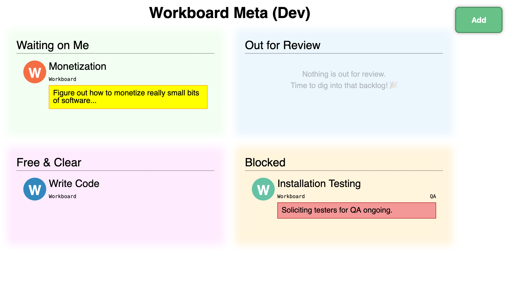

Workboard
=========

This is **Workboard** a single-user productivity app I wrote to
keep track of lots and lots of small and consequential tasks that
can be in one of a handful of states.

Beware! This is _beta_ software.  I'm using this myself, but I
know where the sharp edges are.  I never intended this to be used
by anyone but me, on my own infrastructure.  If you look, you
won't find any built-in authentication, for instance.  **DON'T
deploy this to the Public Internet!**

Workboard operates on Tasks.  A Task is a small string (a summary,
like "Hang the family portrait in the living room"), combined with
another small string (a project, like "Home Improvements").
That's about it for the work description aspects of a task.

Projects are not a first-class concept.  You can't search for
them, filter by them, or deal with all the tasks on the same
project as a unit.  In fact, the _convention_ that two tasks for
"Project Foo" are indeed related is just that: a convention.

Workboard is mostly about tracking blockers, and those come in two
varieties: Waiting on Me and Blocked by Others.  A task is
"waiting on me" if I personally need to do something.  These show
up in the top left quadrant of the board, to highlight their
importance; people waiting on me appreciate when I clear those
blockers first.

A task is "blocked by others" if there's no additional work I can
do until someobne else does something on their end.  Since I can't
control those people, their priorities, or their schedules, these
tasks show up in the bottom right quadrant -- the least important.

(Note: tasks can be both blocked by others _and_ waiting on me, in
which case they show up in both quadrants.)

If a task is not blocked, it is either "free and clear" (bottom
left) and can be worked on when I have time, or "out for review",
in which case my normal interaction with it is to follow up
semi-regularly with the reviewer.
